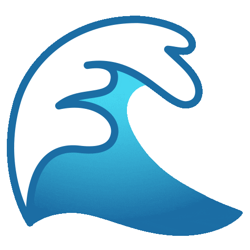

##   Hello, I'm Ali Ahmad!

I'm an undergraduate at Stanford University studying Mathematics and Computer Science. I'm a student researcher at [Stanford AI Lab](https://ai.stanford.edu/), working on robotic manipulation, sensing, controls, and planning under [Karen Liu](https://profiles.stanford.edu/c-karen-liu?tab=bio). I'm also a software team member of [Stanford AUV])(https://www.stanfordrobosub.org/). I'm passionate about robotic learning and solving today's hardest problems. 

Consider visiting [my website](https://www.aliua.me/).
